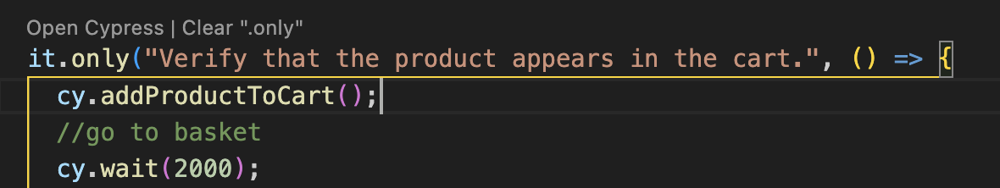
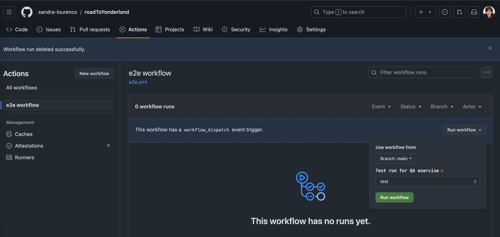
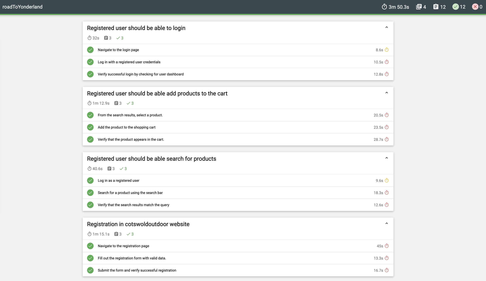

# End-to-End Testing Exercise

This repository contains automated end-to-end (E2E) tests for various user flows such as login, product search, adding a product to the cart, and user registration using Cypress for https://www.cotswoldoutdoor.com/

## Project Structure

```plaintext
cypress/
│
├── e2e/
│   ├── login/
│   │   └── userLogin.cy.js         # User login test
│   ├── product/
│   │   ├── addProductToCart.cy.js  # Add product to cart test
│   │   └── productSearch.cy.js     # Product search test
│   └── registration/
│       └── userRegistration.cy.js  # New user registration test
├── images  /                       # Contains images
├── plugins/                        # Cypress plugin configurations
├── reports/                        # Contains mochawesome test reports
├── screenshots/                    # Test failure screenshots
├── support/                        # Additional support for tests (custom commands)
│   ├── pages/
│   │   ├── productPage.js          # Page object for product page
│   │   ├── cartPage.js             # Page object for product basket
│   │   ├── registrationPage.js     # Page object for registration page
│   │   ├── loginPage.js            # Page object for login actions
│   |── commands.js                 # Custom Cypress commands
│   │── e2e.js                      # End-to-end test initialization
├── node_modules/                   # Node.js dependencies
├── .gitignore                      # Git ignore file
├── cypress.config.js               # Cypress configuration file
├── package.json                    # NPM package file
├── package-lock.json               # NPM lock file
└── README.md                       # Project readme file
```

## Running Tests Locally

### Pre-requisites

Ensure you have the following installed:

- [Node.js](https://nodejs.org/en/) (v12 or higher)
- [Cypress](https://www.cypress.io/)

### Install Dependencies

To install the dependencies, run:

```bash
npm install
```

### Running Cypress Tests

To run the tests locally, use one of the following commands:

#### 1. Open Cypress Test Runner (interactive mode):

This command will open the Cypress GUI, where you can interactively run the tests.

```bash
npx cypress open
```

#### 2. Run Tests in Headless Mode:

This will run all the tests in the terminal without opening the GUI (headless mode).

```bash
npm run test
```

You can specify individual test files by adding the route to the file:

```bash
npx cypress run "cypress/e2e/login/userLogin.cy.js"
```

If you need to run a specific test, you can add .only to the test and run the command:




## Running Tests in GitHub Actions

This repository includes a CI configuration to run the Cypress tests in GitHub Actions. The configuration file is located at:

```plaintext
.github/workflows/e2e.yml
```

To run the tests, in GitHub, under the roadToYonderland repository, go to actions tab and run the workflow:



## Viewing Test Results

### Test Reports

- Test screenshots of failling testes will be saved in the `cypress/screenshots/` directory.

To generate a full report:

```bash
npm run merge-reports
npm run generate-report
```

- A Mochawesome report is generated in the `cypress/reports/` directory.



### GitHub Actions Reports

In the GitHub Actions tab of the repository, you can view the results of the tests directly from the CI pipeline.

Example:


